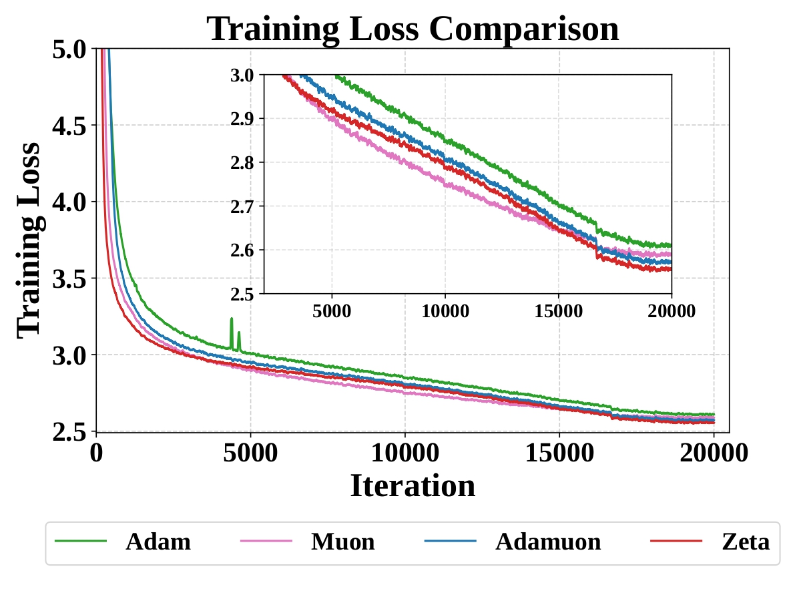
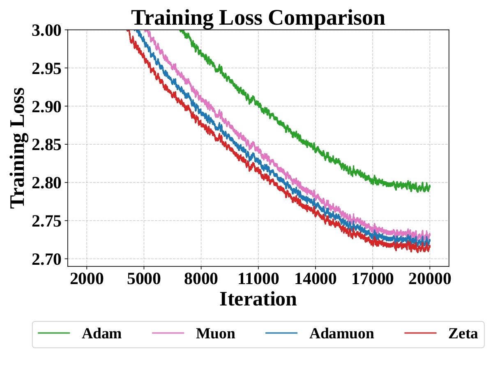
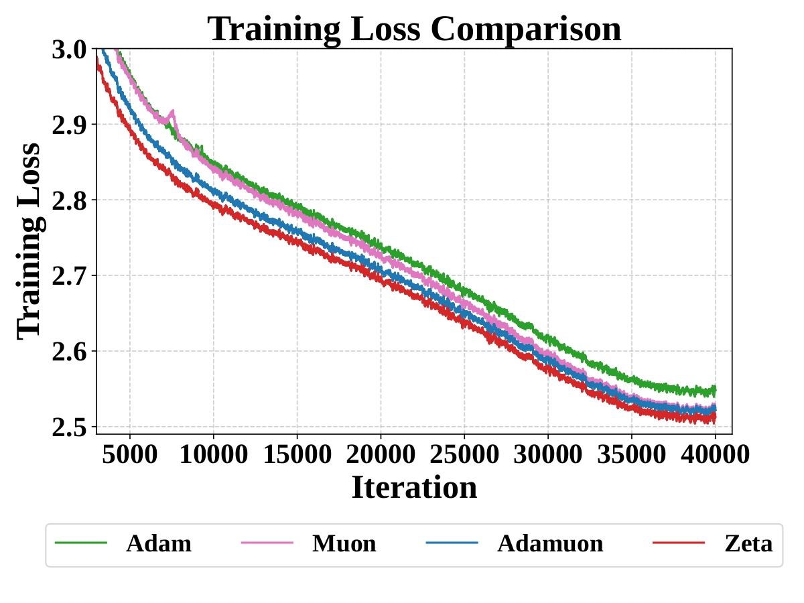
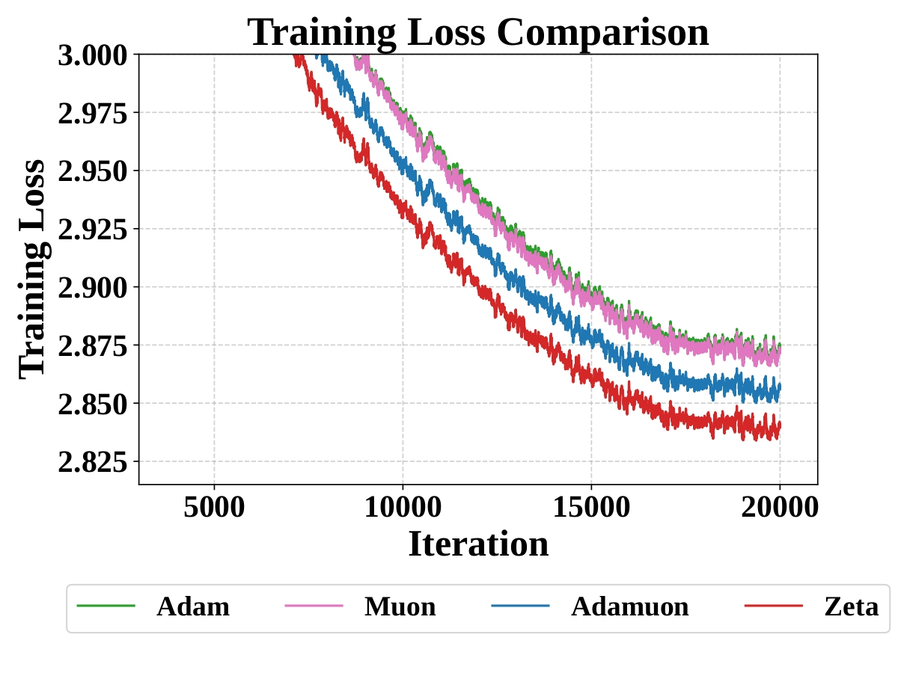

# Zeta Optimizer for Qwen3 Training (MindSpeed Integration)

[English](README_en.md) | [中文](README.md)

## 1. 快速开始

### 脚本位置
所有启动脚本均位于 `examples/mcore/qwen3/` 目录下。请确保您的执行路径位于仓库根目录。

- **Qwen3 0.6B**: `./examples/mcore/qwen3/pretrain_qwen3_0point6b_4K_ptd_zeta.sh`
- **Qwen3 1.7B**: `./examples/mcore/qwen3/pretrain_qwen3_1point7b_4K_zeta.sh`
- **Qwen3 8B**: `./examples/mcore/qwen3/pretrain_qwen3_8b_4K_ptd_zeta.sh`

### 运行命令
```bash
# 以 0.6B 模型为例
bash examples/mcore/qwen3/pretrain_qwen3_0point6b_4K_ptd_zeta.sh <MASTER_PORT> <LR> <NPU_IDS>
```

## 2. 实验结果展示

### 性能表现总结
| 模型规模 | 优化器 | 序列长度 | 训练步数 | 收敛增益 (对比 AdamW) |
| :--- | :--- | :--- | :--- | :--- |
| Qwen3 1.7B | Zeta | 4096 | 20,000 | 1.64x |
| Qwen3 8B | Zeta | 4096 | 40,000 | 1.2x |
| Qwen3 Moe | Zeta | 4096 | 20,000 | 1.32x |

### 实验结果可视化
以下是不同规模 Qwen3 模型在 Zeta 优化器下的 Loss 收敛曲线对比：

#### Qwen3 0.6B 实验对比


#### Qwen3 1.7B 实验对比


#### Qwen3 8B 实验对比


#### Qwen3 MoE 1.3B 实验对比


> **注**：详细的数值报告可参考 `assets/` 目录下的原始 PDF 文件。

## 3. 引用与支持
如果您在研究中使用了 Zeta 优化器或 MindSpeed，请参考相关的技术文档。

---
*Open Source with MindSpeed*
